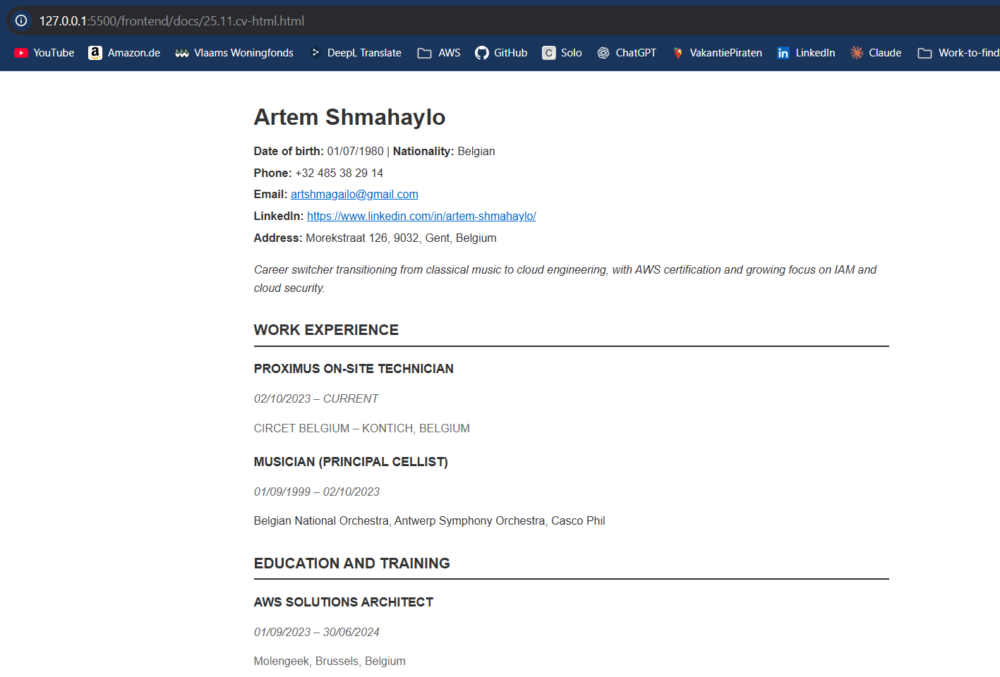
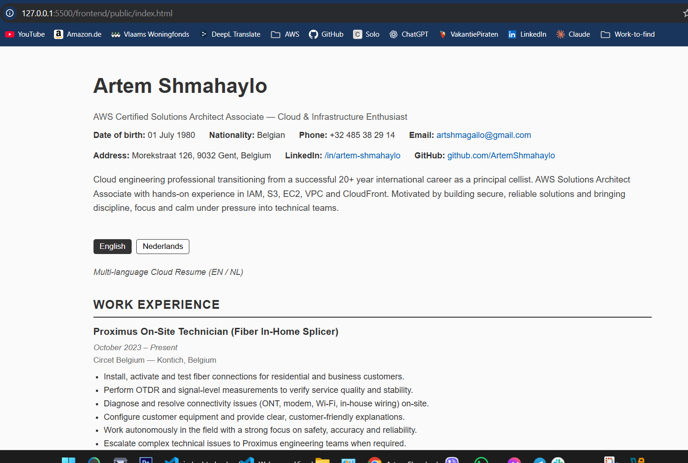
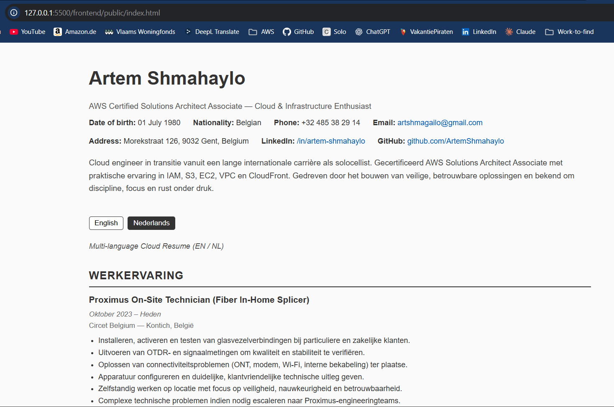

# Frontend Technical Specification

- Create a static website that serves an html resume

## Resume Format Consideration

I live in Belgium and CV's in word/pdf format are suppose to include:
- foto
- date of birth
- nationality
- full address
- email address
- GSM number
- LinkedIn link
- GitHub link
- Short Profile - 2-3 sentences
- Work experience
- Education
- Hard and Soft skills

I will be using [Europass](.frontend/docs/Europass_CV.pdf) template as a basis of my resume

### Europass CV Generation

I do not know HTML, so I will let GenAI do the heavy lifting and generate out HTML and possibly CSS and from there I will manually refactor to my preferred standard.

Prompt to ChatGPT 5.1
```text
- EN/NL language support
- minimalist HTML structure
- inline CSS (no frameworks)
- Belgian CV conventions
- only Belgian education + AWS/CS50
- a language switcher with minimal JS
- UTF-8 + responsive viewport
- clean, simple CSS selectors
```

Image provided to prompt:


This is [generated output](./docs/25.11.cv-html.html) which I will refactor.

This is what the generated HTML looks like unaltered:



## HTML Aljustments

- UTF-8 will support most languages, I plan to use English and Dutch
- Because I will be applying mobile styling to the website I'll include the viewport meta tag "width=device-width" so mobile styling scales normally.
- I will extract my styles into its own stylesheet after I am happy with my HTML markup.
- I will simplify my HTML markup css selector to be as minimal as possible.
- I am using 2-space soft tabs for indentation. This is the default configuration in my editor and keeps the HTML easy to read. If needed, I can adjust this later for consistency across the project.

I performed a full manual refactor with the help of ChatGPT (GPT-5.1), including:
- rewriting the entire HTML layout
- adding bilingual EN/NL support
- restructuring sections for clarity and semantic correctness
- improving accessibility
- creating minimalistic CSS
- adding a JavaScript-based language switcher
- aligning the resume with Belgian CV conventions
- removing all irrelevant content not suitable for a cloud resume project

The final [`index.html`](./public/index.html) represents my own refactored work based on an AI draft,  
following the Bootcamp requirement to improve and personalize the generated output.

This is what the rendered final HTML looks like:




## Serve Static Website Locally

I need to serve my static website locally so I can start using stylesheets externally from my HTML page in a Cloud Developer Encitonment (CDE)

> This is not necessary with local development.

Assuming I have node install I'll use the simple web-server http-server

### Install HTTP Server
```sh
npm i http-server -g
```

https://www.npmjs.com/package/http-server

### Server Website

http-server will server a public folder by default where the command is run.

```sh
cd frontend
http-server
```


## Frontend Framework Consideration

- Using **React** for component-based UI.
- Using **Vite.js** for fast development server and simple project structure.
- Added **React Router** for navigation between pages.
- Implemented a simple **multi-language system (EN/NL)** using separate components.

---

## Frontend Setup Steps

### 1. Create React project with Vite
```bash
npm create vite@latest
cd frontend
npm install
```

### 2. Install React Router
```bash
npm install react-router-dom
```

### 3. Basic project structure
```
src/
  components/ (Nav, LanguageSwitcher, ResumeEN/NL, ProjectsEN/NL, ContactEN/NL)
  pages/ (Home, Resume, Projects, Contact)
  App.jsx
  main.jsx
```

### 4. Enable router in main.jsx
```jsx
<BrowserRouter>
  <App />
</BrowserRouter>
```

### 5. Define routes in App.jsx
```jsx
<Routes>
  <Route path="/" element={<Home />} />
  <Route path="/resume" element={<Resume lang={lang} />} />
  <Route path="/projects" element={<Projects lang={lang} />} />
  <Route path="/contact" element={<Contact lang={lang} />} />
</Routes>
```

### 6. Run the development server
```bash
npm run dev
```

---

## Summary

React + Vite provide a fast and lightweight setup for the Cloud Resume Challenge.  
Routing, navigation, and multi-language support (EN/NL) were implemented using simple, maintainable components.
