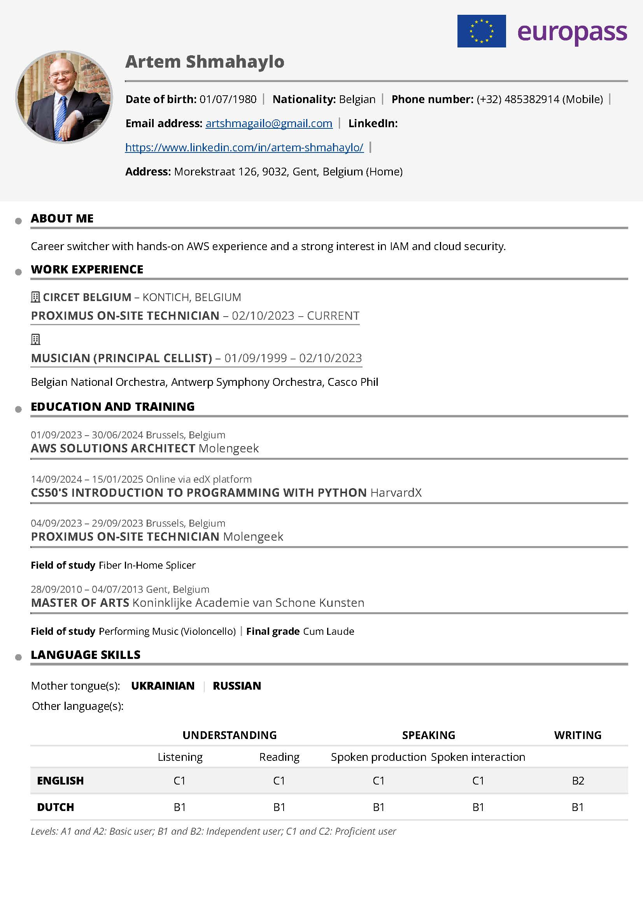
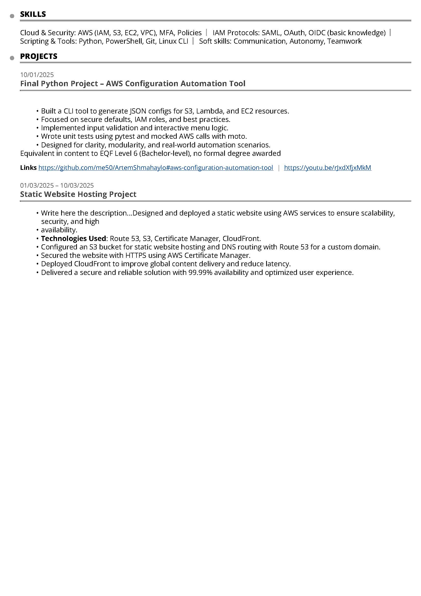

# Frontend Technical Specification

- Create a static website that serves an html resume

## Resume Format Consideration

I live in Belgium and CV's in word/pdf format are suppose to include:
- foto
- date of birth
- nationality
- full address
- email address
- GSM number
- LinkedIn link
- GitHub link
- Short Profile - 2-3 sentences
- Work experience
- Education
- Hard and Soft skills

I will be using [Europass](.frontend/docs/Europass_CV.pdf) template as a basis of my resume

### Europass CV Generation

I do not know HTML, so I will let GenAI do the heavy lifting and generate out HTML and possibly CSS and from there I will manually refactor to my preferred standard.

Prompt to ChatGPT 5
```text
Convert this CV into html format. Please do not use CSS framework. Please use the least amount of CSS tags.
```

Image provided to prompt:



